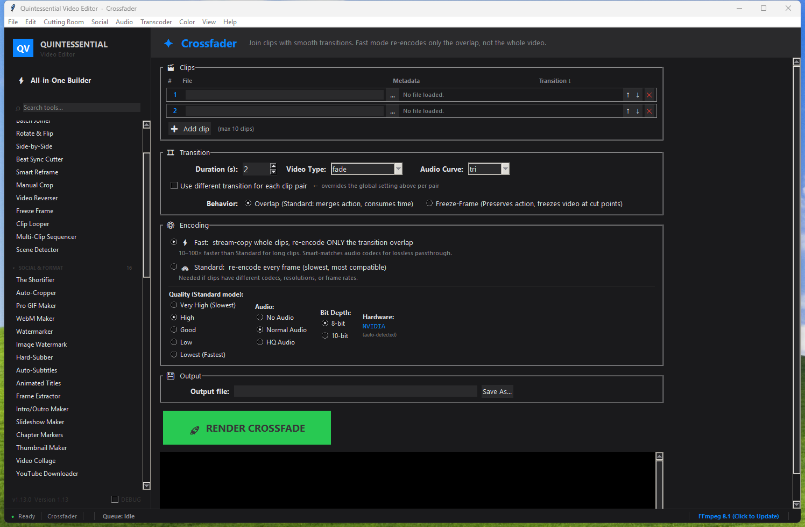

# WyldVeil's Media Editor

A completely free, open-source video and audio processing suite with 70+ tools, 28 languages, and a skinnable UI.

Play a free MMO I have been working on for some time (Very much a work in progress) at: [WyldVeil](https://wyldveil.com)

## Install

1. Download **WyldVeil files for your operating system** from the [Releases](https://github.com/WyldVeil/wyldveils-media-editor/releases/) page
2. Run the installer
3. Launch from the Start Menu or desktop shortcut

Everything is included - just install and play around.

See the [Screenshots](screenshots/) folder for screenshots of every tab in the app.

## What's inside

- **Cutting Room** - Trimmer, crossfader, splicer, splitter, beat sync, scene detection, side-by-side, and more
- **Audio** - Karaoke isolation, voice changer, mixer, ducking, waveform viewer, MIDI converter, text-to-speech
- **Visuals** - Colour correction, LUTs, denoising, stabilisation, green screen, picture-in-picture, speed ramping
- **Social** - Auto subtitles, thumbnails, GIF maker, watermarks, intro maker, YouTube downloader
- **Transcoder** - Format conversion, downscaling, FPS adjustment, proxy generation, encode queue
- **System** - Batch processing, screen recorder, advanced settings

## 🌍 Multilingual

The entire UI is available in 28 languages. Switch any time from the Advanced Settings panel.

| | | |
|---|---|---|
| English (US) | English (GB) | العربية |
| বাংলা | Deutsch | Español |
| فارسی | Français | हिन्दी |
| Bahasa Indonesia | Italiano | 日本語 |
| 한국어 | Bahasa Melayu | Nederlands |
| Naijá Pidgin | Polski | Português (Brasil) |
| Română | Русский | Kiswahili |
| ภาษาไทย | Filipino | Türkçe |
| Українська | اردو | Tiếng Việt |
| 中文 | | |

## Requirements

- Windows 10 or 11 (64-bit)

## Uninstall

Use "Add or Remove Programs" in Windows Settings, or run the uninstaller from the Start Menu.

## What's under the hood

Built with Python and Tkinter. Processing is powered by FFmpeg (bundled). The installer ships with an embedded Python runtime so nothing extra needs to be installed - no Python on your system, no pip, no command line.

The app auto-installs any (completely optional, just for functionality for a small number of tools) Python dependencies (like the text-to-speech engine) into its own private `libs/` folder on first use, keeping your system clean.

### Bundled tools

| Tool | Purpose |
|------|---------|
| [FFmpeg](https://ffmpeg.org/) | Video/audio processing engine |
| [yt-dlp](https://github.com/yt-dlp/yt-dlp) | YouTube and media downloader |
| [FluidSynth](https://www.fluidsynth.org/) | MIDI synthesis |
| [audio-separator](https://github.com/karaokenerds/python-audio-separator) | Vocal/instrument isolation |

## License

All bundled third-party tools retain their original licenses (FFmpeg: LGPL/GPL, yt-dlp: Unlicense, FluidSynth: LGPL-2.1). Application code is provided as-is.
